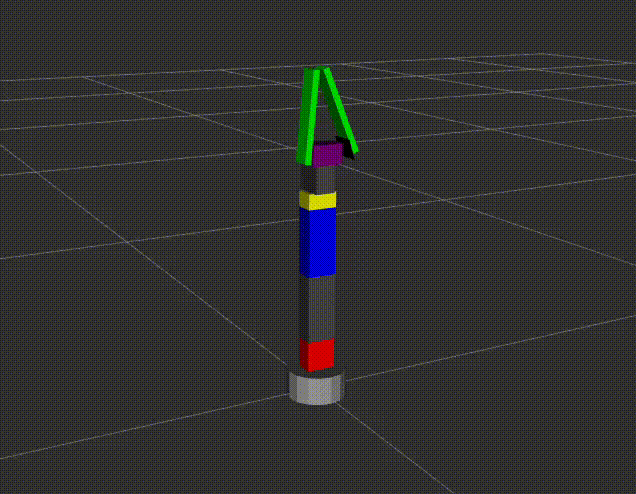

# Braço robótico com 6 Graus de Liberdade

Projeto de um **braço robótico de 6 DOF** utilizando **ROS2** com pacotes para simulação, controle e descrição do modelo.

-----

## 📂 Estrutura do Projeto

  - `meu_braco_control/` → Nó responsável pelo controle do braço robótico.
  - `meu_braco_description/` → Arquivos de descrição do robô (URDF/Xacro e etc).
  - `meu_braco_hardware/` → Integração com o hardware real.
  - `meu_braco_scripts/` → Exemplos em Python de controle do braço
  - `meu_braco_moveit_config/` → Configuração do MoveIt para planejamento de movimento.
  - `moveit_commander_ros2-main/` → Ferramentas para integração com o MoveIt no ROS2.

-----

## 🚀 Tecnologias Utilizadas

  - **ROS2** (Humble/Foxy)
  - **Gazebo** (simulação física)
  - **MoveIt2** (planejamento de movimento)
  - **Python3** (exemplos de controle)
  - **C++** (drivers/hardware)

-----

## ⚙️ Instalação

Clone o repositório:

```bash
git clone https://github.com/Luisjackson/ArmRobotic6DOF.git
cd ArmRobotic6DOF
```

Compile o workspace:

```bash
colcon build
source install/setup.bash
```

-----

## 🕹️ Como Usar

1.  **Executar simulação no Gazebo**
    ```bash
    ros2 launch meu_braco_description gazebo.launch.py
    ```
2.  **Iniciar MoveIt**
    ```bash
    ros2 launch meu_braco_moveit_config demo.launch.py 
    ```
3.  **Iniciar no Rviz**
    ```bash
    ros2 launch meu_braco_description display.launch.py
    ```

-----

## 📸 Demonstração



-----

## 📌 Status do Projeto

✅ Simulação básica no RViz/Gazebo

✅ Integração com MoveIt

🔄 Controle de hardware em desenvolvimento